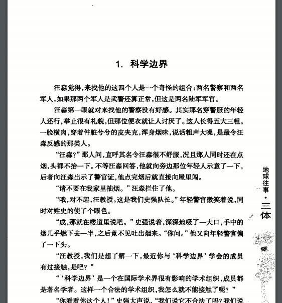
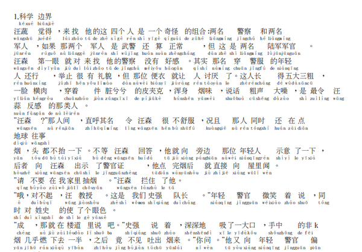

pinyingen: A pinyin annotator for PDFs with simplified chinese
==============================================================
- Install packages: `pip install -r requirements.txt`
- To run: `pinyingen --input=/path/to/mandarin_text.pdf --output='mandarin_annotated.pdf'`

## Original PDF

## Converted PDF
